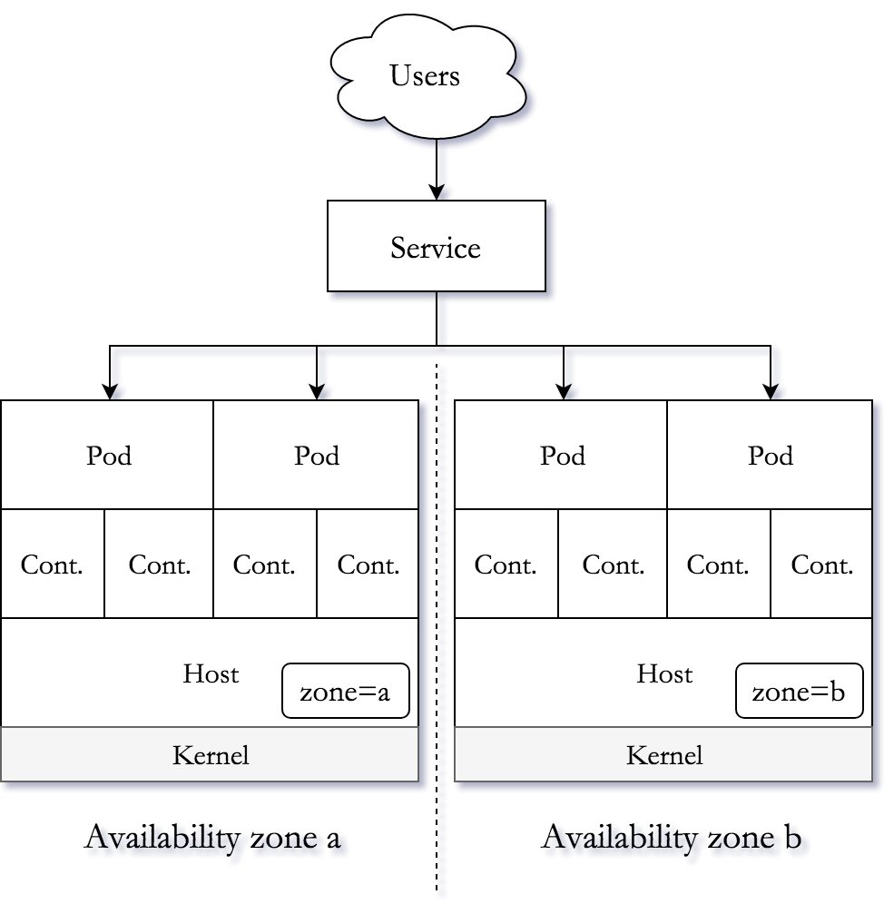

# Microservices, containers, orchestration {bgcss=sky-gradient-14 .light-on-dark}


# Microservices {bgcss=sky-gradient-11}

# A meaningful subset {bgcss=sky-gradient-11}


# Benefits and costs {bgcss=sky-gradient-11}


<small>Source: <a href="https://www.martinfowler.com/microservices/">www.martinfowler.com/microservices</a></small>

# Technology diversity {bgcss=sky-gradient-11}

```render_vegalite
{
  "$schema": "https://vega.github.io/schema/vega-lite/v2.0.json",
  "width": 500,
  "height": 250,
  "data": {
    "values": [
      {"percentage": 71.5, "language": "JavaScript"},
      {"percentage": 54.4, "language": "Java"},
      {"percentage": 40.4, "language": "Bash/Shell"},
      {"percentage": 37.9, "language": "Python"},
      {"percentage": 10.3, "language": "Ruby"},
      {"percentage": 7.2, "language": "Go"},
      {"percentage": 4.3, "language": "Groovy"},
      {"percentage": 4.2, "language": "Perl"},
      {"percentage": 31.4, "language": "PHP"}
    ]
  },
  "mark": "bar",
  "encoding": {
    "x": {
      "field": "percentage",
      "type": "quantitative",
      "axis": { "title": "Developers (%)" },
      "legend": false
    },
    "y": {
      "field": "language",
      "type": "nominal",
      "axis": {
        "title": "Language",
        "offset": 5,
        "ticks": false,
        "minExtent": 60,
        "domain": false,
        "legend": false
      },
      "sort": {"op": "mean", "field": "percentage"}
    },
    "color": {
      "field": "percentage",
      "type": "quantitative",
      "legend": false,
      "scale": {
        "range": ["#c30d24", "#f3a583", "#cccccc", "#94c6da", "#1770ab"],
        "type": "ordinal"
      }
    }
  },
  "config": {
    "axis": {
      "labelFont": "EB Garamond",
      "legendFont": "EB Garamond",
      "labelFontSize": 18,
      "titleFont": "EB Garamond",
      "titleFontSize": 24,
      "titleAngle": 0
    },
    "axisX": {
        "labelAngle": 0
    }
  }
}
```
<small>Source: "Programming, scripting and markup languages", [Stack Overflow survey 2018](https://insights.stackoverflow.com/survey/2018/)</small>

# Operational complexity {bgcss=sky-gradient-11}

```render_dot
digraph G {
    bgcolor=transparent;
    node [style=filled,color=black,fillcolor=white];
    "svc a" -> "svc b";
    "svc a" -> "svc c";
    "svc a" -> "svc d";
    "svc a" -> "svc e";
    "svc b" -> "svc a";
    "svc b" -> "svc c";
    "svc b" -> "svc d";
    "svc b" -> "svc e";
    "svc c" -> "svc a";
    "svc c" -> "svc b";
    "svc c" -> "svc d";
    "svc c" -> "svc e";
    "svc d" -> "svc a";
    "svc d" -> "svc b";
    "svc d" -> "svc c";
    "svc d" -> "svc e";
    "svc e" -> "svc a";
    "svc e" -> "svc b";
    "svc e" -> "svc c";
    "svc e" -> "svc d";
}
```

# Containers {bgcss=sky-gradient-11}

# Hardware: high efficiency, poor utilisation {bgcss=sky-gradient-11}

$\text{PUE}=\frac{\text{Watts in}}{\text{IT watts}}$

```render_vegalite
{
    "$schema": "https://vega.github.io/schema/vega-lite/v2.0.json",
    "data": {
        "values": [
            {"PUE": 1.21, "date": "2008"},
            {"PUE": 1.19, "date": "2009"},
            {"PUE": 1.18, "date": "2010"},
            {"PUE": 1.14, "date": "2011"},
            {"PUE": 1.13, "date": "2012"},
            {"PUE": 1.12, "date": "2013"},
            {"PUE": 1.12, "date": "2014"},
            {"PUE": 1.12, "date": "2015"},
            {"PUE": 1.12, "date": "2016"},
            {"PUE": 1.12, "date": "2017"},
            {"PUE": 1.11, "date": "2018"}
        ]
    },
    "width": 400,
    "height": 200,
    "mark": "line",
    "encoding": {
        "x": {
            "timeUnit": "year", "field": "date", "type": "temporal"
        },
        "y": {"field": "PUE", "type": "quantitative", "scale": {"domain": [1.1, 1.3]}}
    },
    "config": {
        "axis": {
            "labelFont": "EB Garamond",
            "labelFontSize": 18,
            "titleFont": "EB Garamond",
            "titleFontSize": 24,
            "titleAngle": 0
        },
        "axisX": {
            "labelAngle": 0
        }
    }
}
```

<small>Power usage effectiveness data by [Google Data Centers](https://www.google.co.uk/about/datacenters/efficiency/internal/)</small>

# Improving host utilisation {bgcss=sky-gradient-11}


<small><a href="http://www.superluigibros.com/tetris">Image source</a> &ndash; for a brief history of Kubernetes, see Burns et al., <a href="https://queue.acm.org/detail.cfm?id=2898444">Borg, Omega and Kubernetes</a></small>

# Isolated processes {bgcss=sky-gradient-14 .light-on-dark}

```bash
$ docker history `docker images | grep hello-openshift | awk '{print $3}'`
IMAGE               CREATED             SIZE                COMMENT
7af3297a3fb4        3 months ago        6.09MB
<missing>           3 months ago        0B                  Imported from -
```

# Orchestration {bgcss=sky-gradient-11}

# Single-host deployment {bgcss=sky-gradient-11}


# Distributed deployment {bgcss=sky-gradient-11}


# Highly available deployment {bgcss=sky-gradient-11}



# ~~Twelve~~Five factors {bgcss=sky-gradient-11}


<small>Source: <a href="https://12factor.net/">12factor.net</a></small>

# Lab 1 {bgcss=sky-gradient-11}

# A minimal deployment {bgcss=sky-gradient-11}


# Steps {bgcss=sky-gradient-14 .light-on-dark}

```bash
$ oc new-project `whoami`
$ oc new-app --name hello --docker-image=openshift/hello-openshift
$ oc expose svc/hello
$ oc describe route/hello
$ curl hello-`whoami`.apps.cc-openshift.de
Hello OpenShift!
```
# Service {bgcss=sky-gradient-14 .light-on-dark}

```yaml
apiVersion: v1
kind: Service
metadata:
  labels:
    app: hello
  name: hello
spec:
  ports:
  - name: 8080-tcp
    port: 8080
    protocol: TCP
    targetPort: 8080
  selector:
    app: hello
    deploymentconfig: hello
```

# Route {bgcss=sky-gradient-14 .light-on-dark}

```yaml
apiVersion: v1
kind: Route
metadata:
  labels:
    app: hello
  name: hello
spec:
  host: hello-gerald.apps.cc-openshift.de
  port:
    targetPort: 8080-tcp
  to:
    kind: Service
    name: hello
    weight: 100
  wildcardPolicy: None
```
# Cleanup {bgcss=sky-gradient-14 .light-on-dark}

```bash
$ oc delete all -l app=hello
deploymentconfig "hello" deleted
imagestream "hello" deleted
route "hello" deleted
pod "hello-1-q42wr" deleted
service "hello" deleted
```

# Recap {bgcss=sky-gradient-14 .light-on-dark}

<asciinema-player src="./assets/img/lab01.json"
    poster="npt:0:6"
    idle-time-limit=1
    speed=1
    rows=18
    font-size="medium"
></asciinema-player>

# Lab 2 {bgcss=sky-gradient-11}

# A broken deployment {bgcss=sky-gradient-11}


# Steps {bgcss=sky-gradient-14 .light-on-dark}

```bash
$ git clone \
  https://github.com/gerald1248/microservices-containers-orchestration
$ cd microservices-containers-orchestration/
$ oc new-app -f k8s/template-hello-broken.yml
$ oc expose svc/hello
$ oc get po
NAME             READY     STATUS             RESTARTS   AGE
hello-1-deploy   1/1       Running            0          13s
hello-1-r6l72    0/1       ImagePullBackOff   0          11s
```

# Faulty DeploymentConfig (excerpt) {bgcss=sky-gradient-14 .light-on-dark}

```yaml
    spec:
      containers:
      - image: openshift/hullo-openshift
        imagePullPolicy: Always
        name: hello
        ports:
        - containerPort: 8080
          protocol: TCP
        - containerPort: 8888
          protocol: TCP
        resources: {}
```

# DeploymentConfig fixed {bgcss=sky-gradient-14 .light-on-dark}

```bash
$ oc edit dc/hello
:%s/hullo-openshift/hello-openshift/
:x
deploymentconfig "hello" edited
```

# Interim result {bgcss=sky-gradient-14 .light-on-dark}

```bash
$ curl hello-`whoami`.apps.cc-openshift.de
...
  <body>
    <div>
      <h1>Application is not available</h1>
      ...
    </div>
  </body>
```

# Check the pod is working {bgcss=sky-gradient-14 .light-on-dark}

```bash
$ oc get po
NAME            READY     STATUS    RESTARTS   AGE
hello-2-897mg   1/1       Running   0          6m
$ oc port-forward hello-2-897mg 58080:8080
Forwarding from 127.0.0.1:58080 -> 8080
```
<small>Then, in a separate terminal:</small>
```bash
$ curl localhost:58080
Hello, OpenShift!
```
<small>The pod works as intended.</small>

# Faulty service (excerpt) {bgcss=sky-gradient-14 .light-on-dark}

```yaml
apiVersion: v1
kind: Service
metadata:
  labels:
    app: hello
  name: hello
spec:
  ports:
  - name: 8080-tcp
    port: 8080
    protocol: TCP
    targetPort: 8080
  selector:
    app: hello-openshift
    deploymentconfig: hello
```

# Service fixed {bgcss=sky-gradient-14 .light-on-dark}

```bash
$ oc edit svc/hello
:%s/hello-openshift/hello/
:x
service "hello" edited
```

# Result {bgcss=sky-gradient-14 .light-on-dark}

```bash
$ curl hello-`whoami`.apps.cc-openshift.de
Hello OpenShift!
```

# Cleanup {bgcss=sky-gradient-14 .light-on-dark}

```bash
$ oc delete all -l app=hello
deploymentconfig "hello" deleted
route "hello" deleted
pod "hello-1-q42wr" deleted
service "hello" deleted
```

# Finally {bgcss=sky-gradient-14 .light-on-dark}

<asciinema-player src="./assets/img/lab02.json"
    poster="npt:0:9"
    idle-time-limit=1
    speed=1
    rows=18
    font-size="medium"
></asciinema-player>

# <small>Thank you</small> {bgcss=sky-gradient-16 .light-on-dark}

<small>Clone at [gerald1248/microservices-containers-orchestration](https://github.com/gerald1248/microservices-containers-orchestration)</small>

<small>Slides courtesy of markdeck by @arnehilmann [arnehilmann/markdeck](https://github.com/arnehilmann/markdeck)</small>


